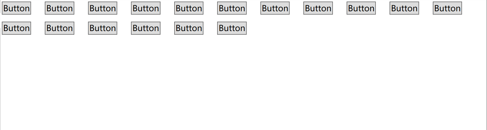

## About 
<p>
Extended controls for Wpf. The Border has BoxShadow like as Web css3, a WrapPanel that can adjust the spacing.
</p>

<p>
Supporting .NET Framework 4.0 and greater, .NET Core 3.0 and greater(on Windows)
</p>

## How to use
1. Add nuget package to your project:
    > if you use .net cli, execute this:
    ```shell
    dotnet add package Yumikou.Wpf.Controls
    ```
    > if you use vs package-manager, execute this:
    ```shell
    Install-Package Yumikou.Wpf.Controls
    ```
2. Add Namespaces to your  `.xaml` file:
   ```xaml
   xmlns:ymk="clr-namespace:Yumikou.Wpf.Controls;assembly=Yumikou.Wpf.Controls"
   ```
3. The control use cases:
   #### Border with BoxShadow
   ```xaml
    <ymk:Border Width="100" Height="100" Background="Transparent" CornerRadius="30">
        <ymk:Border.BoxShadows>
            <ymk:BoxShadow Blur="0" Spread="10" Brush="#6600ff00" OffsetX="0" OffsetY="0"></ymk:BoxShadow>
            <ymk:BoxShadow Blur="20" Spread="5" Brush="#88ff0000" OffsetX="20" OffsetY="20"></ymk:BoxShadow>
        </ymk:Border.BoxShadows>
    </ymk:Border>
   ```
   

   #### WrapPanel can adjust the spacing
   ```xaml
    <ymk:WrapPanel HorizontalSpacing="20" VerticalSpacing="10">
        <Button>Button</Button>
        <Button>Button</Button>
        ...
    </ymk:WrapPanel>
   ```
   

## TODO
   - Inset BoxShadow
   - Grid has lines